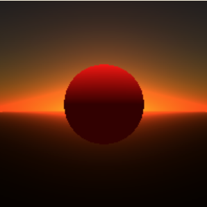
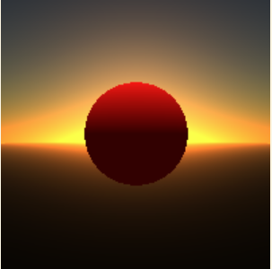
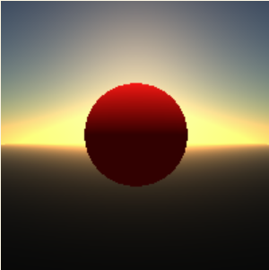

# Assignment 10
朱昀玮

我做的内容是基于物理的大气散射渲染。考虑了 Rayleigh 散射、Mie 散射和 Ozone Layer Absorption。

在原本的作业框架上，将渲染背景色改为渲染天空。

主要添加了 atmosphere.h 和 atmosphere.cpp 两个文件。
在 scene 的配置文件中添加了 Sky 一栏，可以调整 sunAngle。详见 scene/scene6_01_sphere.txt. 运行脚本为 script.bat.

效果图在 result 文件夹中。

sun angle = 22

sun angle = 5

sun angle = 10
